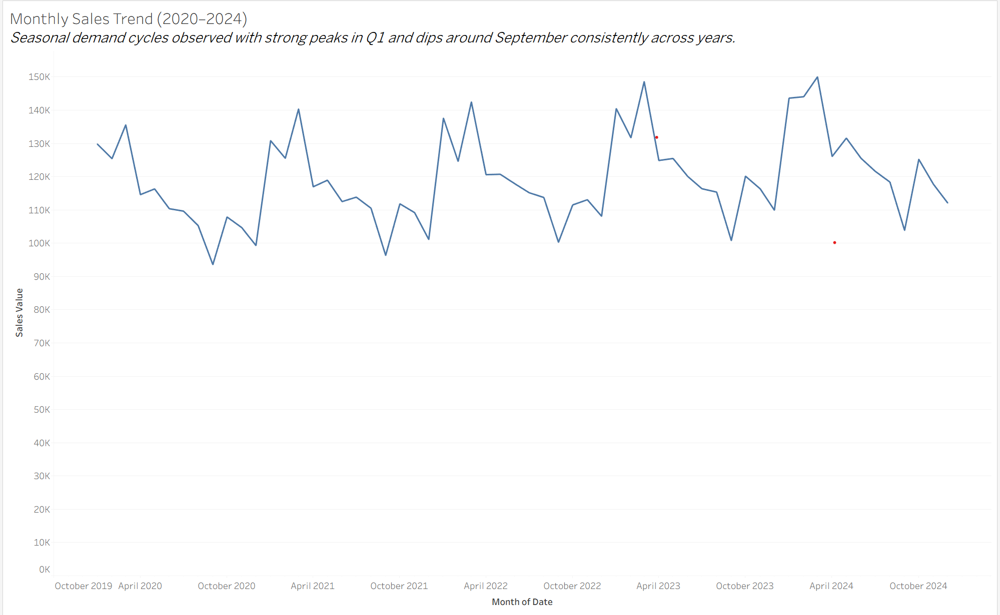
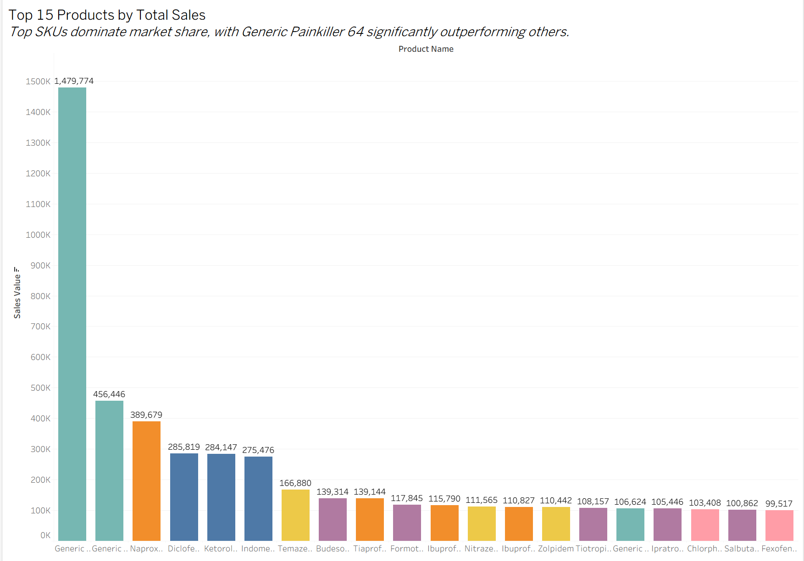
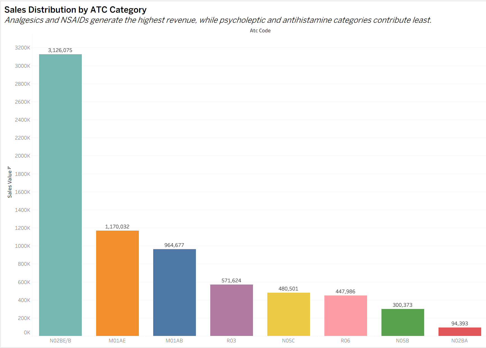
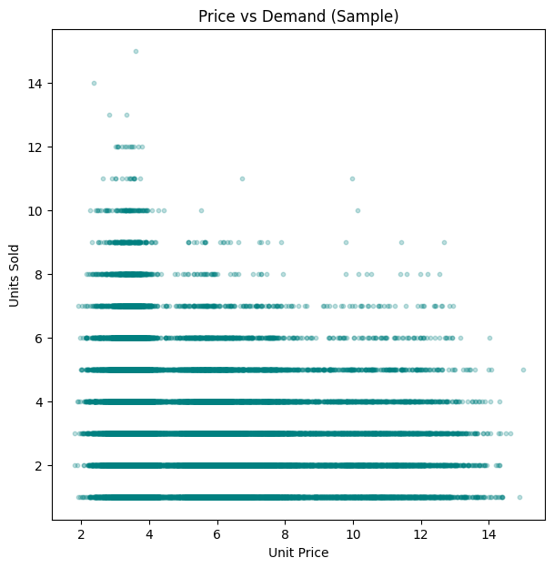

# Pharma Sales & Inventory Intelligence — From Data Cleaning to Tableau Insights

This project demonstrates a complete analytics workflow on a synthetic dataset of pharmaceutical sales transactions.  Starting from raw CSV files, it cleans and organises the data, builds aggregated tables for analysis, engineers predictive features, fits forecasting models, and prepares outputs for interactive dashboards in Tableau.  The entire pipeline is reproducible with a few simple commands.

## Short Dataset Description

The dataset contains **501 046** daily sales transactions recorded between **2020‑01‑01** and **2024‑12‑31**.  Each record describes the number of units sold, unit price, discount, promotion flag and resulting revenue for a specific product at a given retailer and region.  There are **65** unique products, **8** ATC therapeutic classes, **10** regions and **30** retailers.  Total revenue across the five‑year period is approximately **£7.16 million** in the synthetic currency.  The top therapeutic categories by revenue are analgesics (N02BE/B), non‑steroidal anti‑inflammatory drugs (M01AE and M01AB), respiratory treatments (R03) and hypnotics/sedatives (N05C).

## Overview & Flow

The repository follows a modular structure that separates raw data, processed data, code, notebooks, SQL and documentation.  The high‑level flow is illustrated below:

1. **Python ETL** (`src/ingest_clean.py` → `src/transform_metrics.py`)
   - Read the raw CSV, parse dates and clean invalid rows.
   - Write a cleaned dataset to `data/processed/sales_clean.csv`.
   - Aggregate the data to monthly grain by product, ATC code and region, computing total units, total sales, average unit price and promotion days.
   - Produce exploratory charts and save them in the `imgs/` folder.

2. **SQL Layer** (`sql/schema.sql`, `sql/views.sql`, `sql/analysis_queries.sql`)
   - Define star‑schema tables for dates, products, regions, retailers and the sales fact table.
   - Create analytical views for monthly trends, product performance and simple reorder heuristics.
   - Provide example queries for top sellers, year‑over‑year growth, retailer concentration and ABC segmentation.

3. **Notebooks** (`notebooks/`)
   - `01_data_cleaning_eda.ipynb`: replicates the cleaning steps, previews the data and visualises key patterns.
   - `02_feature_engineering.ipynb`: constructs lag/rolling/calendar features, examines correlations and assesses feature importance with a baseline XGBoost model.
   - `03_forecasting_analysis.ipynb`: selects the top products by sales, fits a SARIMA baseline and an XGBoost regressor, compares their forecast accuracy and exports horizon forecasts for each SKU.

4. **Tableau Workbook** (`tableau/Pharma_Sales_Insights.twbx`)
   - A placeholder for building interactive dashboards.  Use the processed datasets and SQL views to design KPI tiles, trend charts, product/regional insights and forecast tabs.  (You can develop this in Tableau; the file here is currently empty.)

## Quick Start

Clone or download this repository and ensure the raw dataset (`pharma_sales.csv`) is placed in `data/raw/`.  Then execute the pipeline as follows:

```bash
# Install dependencies
pip install -r env/requirements.txt

# Run ETL scripts (cleaning and aggregation)
python src/ingest_clean.py
python src/transform_metrics.py

# (Optional) Execute notebooks with outputs
papermill notebooks/01_data_cleaning_eda.ipynb notebooks/01_data_cleaning_eda.ipynb
papermill notebooks/02_feature_engineering.ipynb notebooks/02_feature_engineering.ipynb
papermill notebooks/03_forecasting_analysis.ipynb notebooks/03_forecasting_analysis.ipynb

# Or simply run make to do everything
make all
```

Executing the forecasting notebook will generate a set of CSV files (`data/processed/forecast_<sku>.csv`) containing actual and predicted values for the last six months of the sample and forecasts for the next six months for each top SKU.

### 3. Tableau Business Intelligence Layer

Interactive dashboard enabling exploration of sales trends, seasonality, regional behaviour, product performance & promotional impact.

🔗 **Live Tableau Dashboard**  
https://public.tableau.com/views/Pharmacyproject_17633176318690/Sheet1

---

## 📊 Tableau Insights & Key Findings

Below are static snapshot previews (stored in the `imgs/` folder).

| Insight | Summary | Snapshot |
| --- | --- | --- |
| **Monthly Sales Trend (2020–2024)** | Clear recurring pattern: peak demand in Q1, dip in September, recovery in Q4. |  |
| **Top 15 Products by Total Sales** | Generic Painkiller 64 dominates market share, far exceeding others. |  |
| **Sales Distribution by ATC Category** | Analgesics & NSAIDs produce highest share of revenue. |  |
| **Seasonality Pattern Across 5 Years** | Strong repeatable seasonal cycle validates predictability. |  |
| **Regional Sales Heatmap (Monthly)** | London, South West, South East strongest; North East weakest. |  |
| **Promotional Activity vs Sales Impact** | Promotions correlate with demand peaks but seasonality is stronger than promotion alone. |  |
| **Price vs Demand** | Weak negative correlation; higher price slightly reduces sales volume. |  |

---

## 🧠 Business Value & Recommendations

| Opportunity | Impact |
| --- | --- |
| Seasonal trends support proactive inventory planning | Reduced stockouts and waste |
| Concentrated revenue among few products | SKU prioritisation for supply chain optimisation |
| Clear regional segmentation patterns | Targeted marketing & distribution |
| Promotions are not primary demand driver | Align campaigns with seasonal peaks |
| Forecastability supports demand planning | Improved cashflow and warehouse efficiency |

---
## Data Model & SQL

The analytical data model uses a **star schema**.  A central fact table (`fact_sales`) records transactional metrics for each date/product/region/retailer combination.  Surrounding dimension tables include:

- `dim_date`: calendar attributes (year, month, day, quarter)
- `dim_product`: product identifiers, names and ATC codes
- `dim_region`: geographic regions
- `dim_retailer`: retailer identifiers

Example SQL views provide reusable logic for monthly trends, product performance and reorder signals.  Analysis queries demonstrate how to compute top sellers per region/month, year‑over‑year growth, retailer concentration and ABC segmentation.  See the `sql/` directory for the full definitions.

## Key Insights

- **Seasonality:** Sales peak during January–March (cold/flu season) and April–August (allergy season), with clear troughs towards year‑end.  Planning production and inventory around these cycles can minimise stock‑outs and excess supply.
- **Pareto Distribution:** Approximately 20 % of products contribute ~80 % of total revenue.  In particular, *Generic Painkiller 64* and *Generic Painkiller 55* are runaway leaders in this synthetic portfolio.  Focusing marketing and supply efforts on these SKUs yields outsized returns.
- **Therapeutic Concentration:** Analgesics (N02BE/B) account for nearly half of total sales, followed by non‑steroidal anti‑inflammatories (M01AE/M01AB) and respiratory treatments (R03).  These categories drive business performance.
- **Price Elasticity:** The scatter of unit price versus units sold exhibits a modest negative slope—demand decreases as price increases, but not dramatically.  Promotions boost sales volumes but should be aligned with seasonal demand spikes for maximum impact.
- **Forecasting Performance:** The Seasonal Naive model slightly outperformed the Gradient Boosting Regressor (GBR) on short-term forecasts, reflecting the dataset’s strong annual seasonality.
While the naive approach captured recurring patterns efficiently, the GBR model demonstrated potential for scaling to larger, feature-rich datasets ; where factors like promotions, regional trends, and price changes can enhance predictive accuracy.
Six-month product-level forecasts are included in /data/processed/.

## Reproducibility & Notes

All code is written in Python 3 and relies on open‑source libraries such as pandas, matplotlib, statsmodels and xgboost.  Environment dependencies are listed in `env/requirements.txt`.  The notebooks are executed in place via Papermill to ensure that code, output and commentary are preserved together.  If you re‑run the notebooks on the same synthetic data, the results should be deterministic.  Should you wish to use real data, adjust the paths and repeat the ETL and modelling steps.

The Tableau workbook (`tableau/Pharma_Sales_Insights.twbx`) is provided as a placeholder; you can import the processed datasets and SQL views to build interactive dashboards showcasing KPIs, trends, ABC segmentation and forecasts tailored to your business needs.
